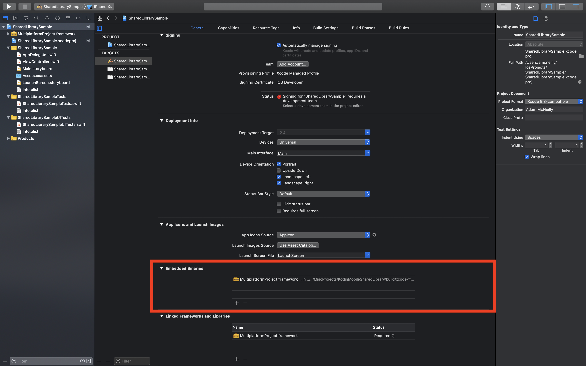
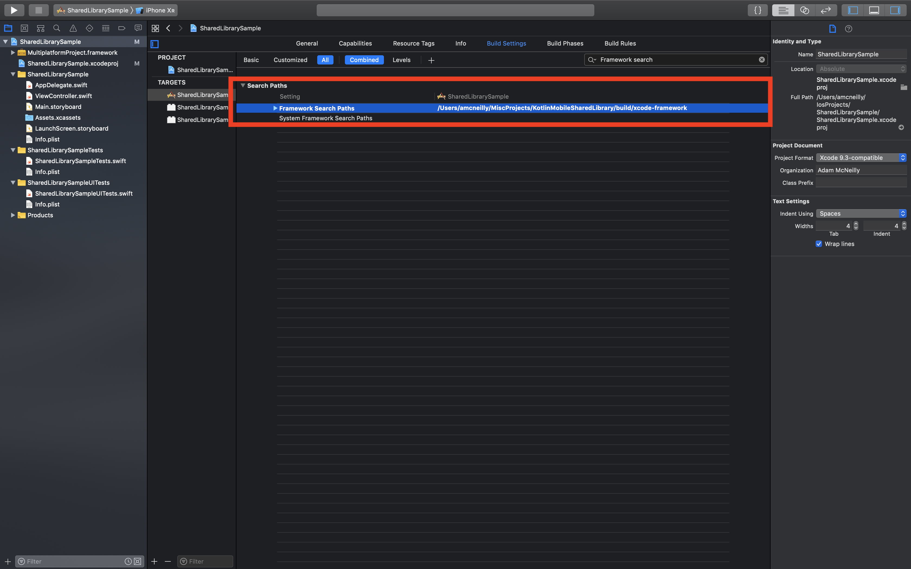

# Kotlin Mobile Shared Library Template

This is a GitHub [template repository](https://github.blog/2019-06-06-generate-new-repositories-with-repository-templates/) for a shared library for Kotlin Multiplatform. If you want to use this, simply click the "Use this template" button rather than forking the repository so you can modify your own project. 

The purpose of this repo is to help you get up and running quickly with a multiplatform library that can be used by both iOS and Android. This is done by resolving a lot of the "Day One" pains for Kotlin Multiplatform, including project setup and publishing. 

This template repo already supports publishing artifacts locally, which you can read about below.

# Publishing The Library Locally

Once you've cloned this repo, you'll have a working project that can be exported for iOS and Android.  

## Publishing For Android 

You will see a gradle task generated for each Android build type:

* `publishAndroidDebugPublicationToMavenLocal`
* `publishAndroidReleasePublicationToMavenLocal`

You can run these individually, but I tend to use the `publishToMavenLocal` task which publishes all Android variants and other targets as well. 

This should output an Android library which you can import using the following:

`implementation 'com.mycompany:MultiplatformProject-android:0.0.1'`

However, whenever I tried to import this into an Android project I get an error about being unable to resolve this dependency. I can work around this by just importing the common dependency:

`implementation 'com.mycompany:MultiplatformProject:0.0.1'`

Note that you will also need to add `mavenLocal()` to your repositories block in the `build.gradle` file.

Here is a short snippet of what your app module's `build.gradle` may look like:

```groovy
repositories {
    mavenLocal() 
}

dependencies {
    implementation "com.mycompany:MultiplatformProject:0.0.1"
}
```

## Publishing For iOS

This project also contains a gradle task called `packForXcode`. This will build an iOS Framework that you can add inside of your application.

Once you've run that task, open up your Xcode project and take the following steps:

1. Click on the root node of the project navigator (will be your project's name).
2. Open the General tab, and scroll down to the Embedded Binaries section.
3. Click the plus icon, and navigate to the framework folder. This will be `/path/to/KotlinMobileSharedLibrary/build/xcode-frameworks/MultiplatformProject.framework`

After this step, you should see something like this.



Now that we have a reference to the framework, we need to tell xcode where to look to find it. Move over to the Build Settings tab and look for the Framework Search Paths option. Add the path to the framework by putting in `/path/to/KotlinMobileSharedLibrary/build/xcode-frameworks`.



Note that you must run `packForXcode` any time you change the code if you want to see those changes to the framework in your iOS app as well. 

## Changing Publishing Values

If you're doing more than just exploring Kotlin Multiplatform and you want to change the way the values are published, there's two easy steps for you.

1. In [build.gradle](build.gradle) you will change the `group` and `version` to tweak the maven dependencies that get published.
2. To change the artifact name for the maven publications, and the iOS framework, go to [settings.gradle](settings.gradle) and change the project name to whatever you want.